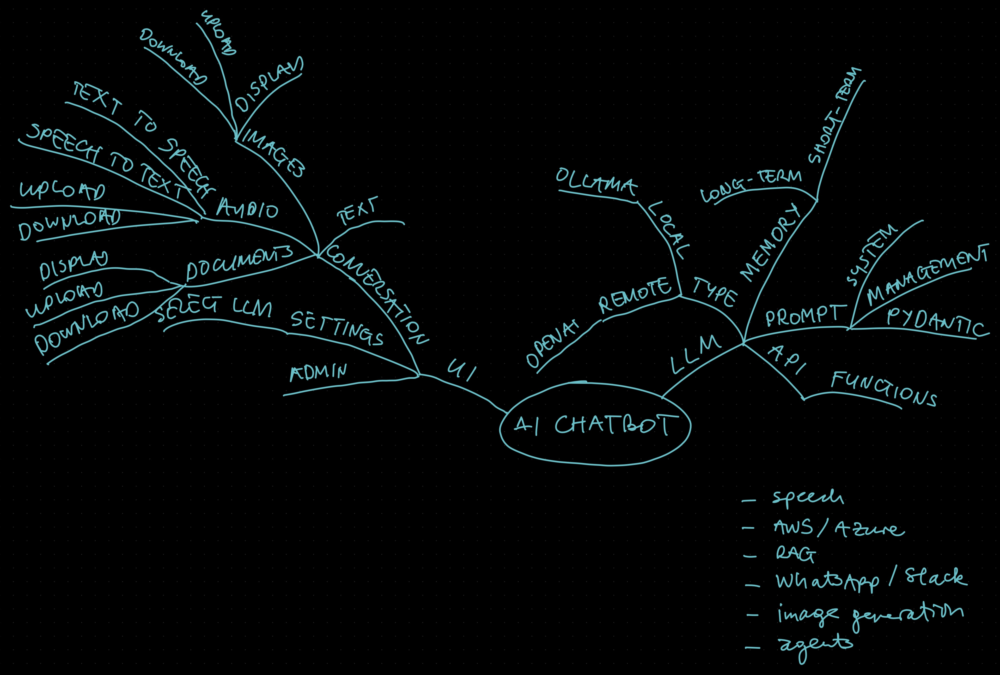

# chatbot

let's build our own chatbot!

This code establishes a framework for creating and managing a chatbot that can interface with different AI models from services like OpenAI and Ollama. The core functionality includes conversation management, model response generation, token count estimation, and handling streaming responses. Here's a detailed analysis of each component and its purpose:

## Main Components

### **1. Import Statements and Initial Setup**

- The initial section imports necessary libraries and suppresses specific warnings related to tokenizers. It sets up the environment, especially regarding tokenizer parallelism, to prevent potential issues in a multi-threaded or multi-processing context.

### **2. Conversation Management (`Conversation` class)**

- Manages the conversation history, including both prompts and responses, along with the token counts to ensure the conversation doesn't exceed model-specific limits.
- Tracks both actual and estimated token counts, useful for managing long conversations within the constraints of AI model token limits.
- Provides functionalities to add prompts and responses to the conversation history, manage token count overflow by removing older entries, and access the history and total token count.

### **3. Abstract Base Client (`ChatClient` class)**

- An abstract base class defining the interface that all chat service clients (e.g., OpenAI, Ollama) must implement. This ensures that any client integrated into the system supports essential operations such as listing models, generating responses (both streaming and non-streaming), and estimating token counts.

### **4. OpenAI Client (`OpenAIClient` class)**

- Implements the `ChatClient` interface for the OpenAI API. It includes methods to list available models, generate responses to prompts, stream responses for real-time interaction, and estimate token counts for given texts.
- Utilizes the `backoff` library to handle retries on request exceptions gracefully, ensuring robust communication with the OpenAI API.

### **5. Ollama Client (`OllamaClient` class)**

- Similar to the `OpenAIClient`, this class implements the `ChatClient` interface for interacting with the Ollama API. It provides the same set of functionalities adjusted for the Ollama API's specifics.

### **6. Chatbot Orchestrator (`Chatbot` class)**

- Orchestrates the conversation flow, integrating with AI client services to manage prompts, responses, and token counts. It's responsible for initializing the chat session, adding user and system prompts to the conversation, and generating responses.
- Supports both streaming and non-streaming modes for generating responses, allowing for real-time interaction with AI models.
- Manages client initialization based on the model and available services, dynamically adjusting to the model's availability and the services' status.

## Key Functionalities

- **Model and Client Selection**: The system can dynamically choose between different AI services based on the model's availability and compatibility. This is particularly useful when working with multiple backend services or when models are updated or migrated between services.

- **Token Count Management**: To ensure conversations stay within the model's maximum token limit, the system tracks token counts closely, using estimated counts for user prompts and actual counts for model responses. This feature is critical for long conversations or when dealing with verbose user inputs.

- **Streaming and Non-Streaming Responses**: The framework supports both streaming and non-streaming modes for model responses. Streaming mode allows the chatbot to provide real-time, incremental output, enhancing the user experience for scenarios where immediate feedback is crucial.

- **Conversation History Management**: By maintaining a detailed record of the conversation history, including role, content, and token counts, the system can manage long conversations effectively. It also supports pruning older parts of the conversation to maintain compliance with token limits, ensuring the chatbot can continue interacting with the user without interruption.

## Documentation Recommendations for Developers

When building on top of this framework, developers should:

- **Understand the Client Interface**: Familiarize themselves with the `ChatClient` abstract base class to ensure any new client implementations (for additional AI services) adhere to the expected interface.

- **Manage Token Limits Carefully**: Pay close attention to how the system estimates and manages token counts, especially when introducing new functionalities or modifying existing ones. This is crucial to avoid exceeding model limits.

- **Extend Conversation Management**: When adding new features or customizations to the conversation logic (e.g., handling specific types of prompts or responses), ensure that the conversation history and token count management are updated accordingly.

- **Integrate New AI Services**: To integrate a new AI service, create a new client class that implements the `ChatClient` interface, ensuring it handles model listing, response generation (both streaming and non-streaming), and token count estimation according to the service's specifics.

- **Test Streaming and Non-Streaming Modes**: Thoroughly test both modes of operation to ensure the chatbot behaves as expected in real-time interactions and more traditional request-response scenarios.

